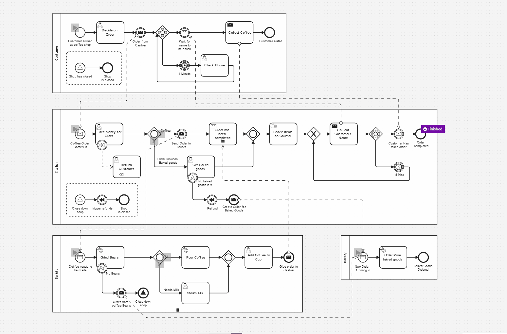

# BPMN Communication Example
This is an example documents the communication between four BPMN processes which together will produce a nice coffee for someone.

It utilizes the following symbols some throwing 🖐 and catching ✊.  for communication. 

* Message ( 🖐 ✊ ) events
* Message ( 🖐 ✊ ) tasks
* Signal events ( 🖐 ✊ )
* Compensation ( 🖐 ✊ ) events
* Compensation task
* Escalation event ( ✊ )
